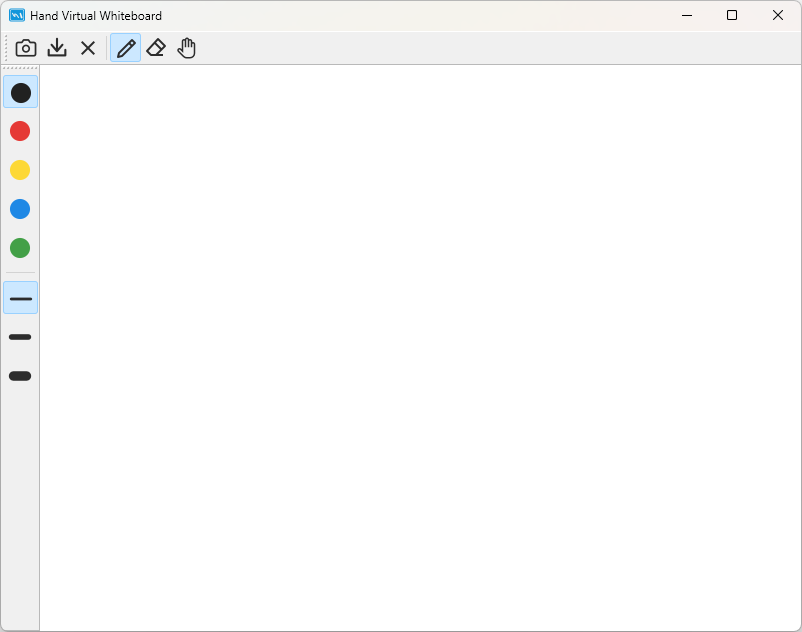
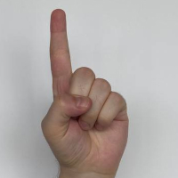
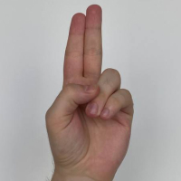
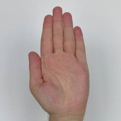
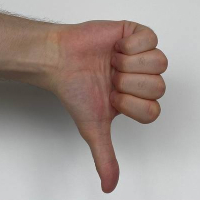
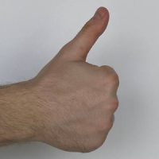
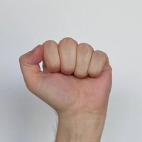

# Hand Virtual Whiteboard

[](https://github.com/RyanXinOne/hand-virtual-whiteboard)

<div align="center"></div>

A hand-controlled virtual whiteboard app allows users to operate tools like pen, eraser, page drag, and other actions through hand gestures captured by a laptop camera in real-time. Users can draw on the whiteboard by moving their fingers before the camera, which acts as a source of control for the pencil or cursor on the screen. The app's backend utilizes machine learning techniques, such as the [YOLO](https://github.com/eriklindernoren/PyTorch-YOLOv3) object detection method and VGG network both trained from [HaGRID](https://github.com/hukenovs/hagrid) dataset, which runs in real-time for hand detection and fingertip localisation.

## Running Application

### Prerequisites

- OS: Windows 10/11 (recommended), Linux
- Nvidia GPU + CUDA + cuDNN: It requires a GPU to achieve the real-time performance. The app has been tested on a GTX1660Ti GPU with CUDA 12.0. (Note that the application could still start without CUDA environment. However, the hand drawing mode would be disabled.)
- Python >= 3.8
- An available camera device

### Python Dependencies

You could run the following command to install the required Python packages. Or install packages in `requirements.txt` manually.

```bash
pip install -r requirements.txt
```

### Starting Application

```bash
python start.py
```

## Usage

The following gestures could be used to control the application.
|           Pen           |            Eraser             |         Page Drag         |          Clear Canvas           |       Export Image        |           Null            |
| :---------------------: | :---------------------------: | :-----------------------: | :-----------------------------: | :-----------------------: | :-----------------------: |
|  |  |  |  |  |  |
